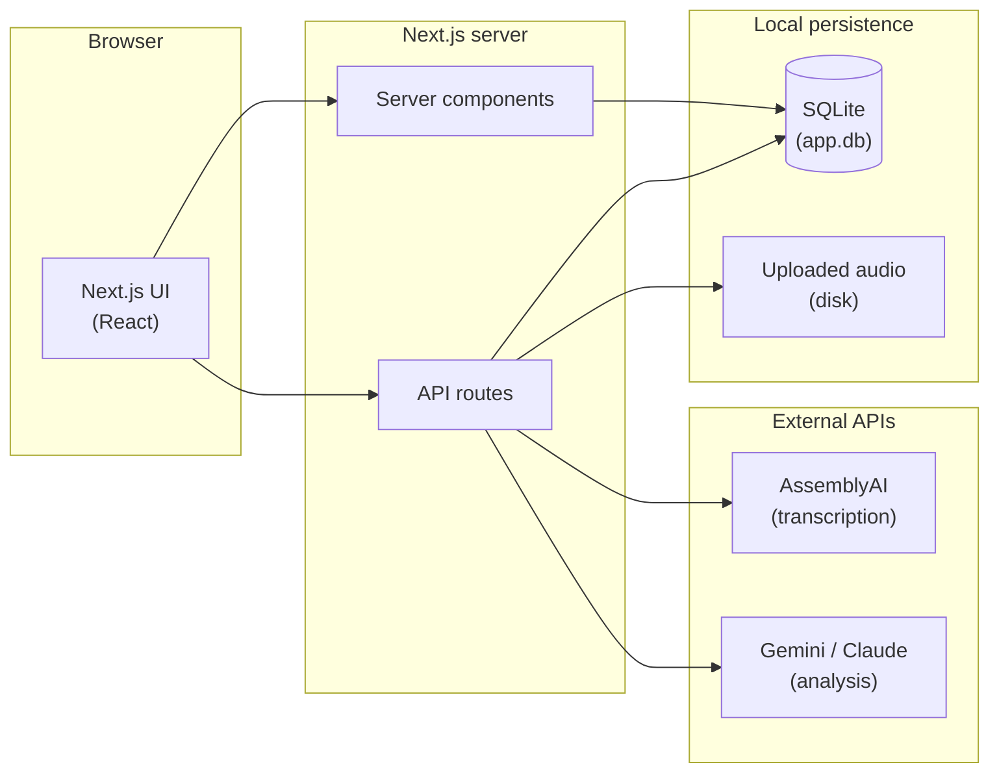
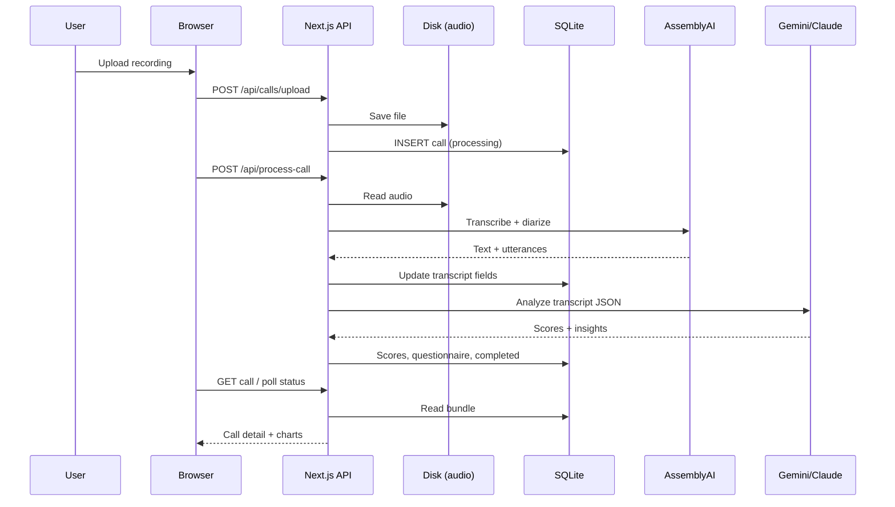
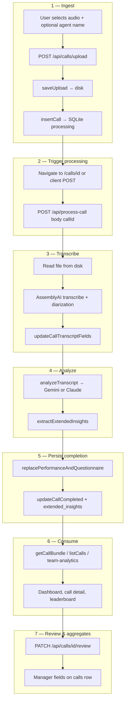
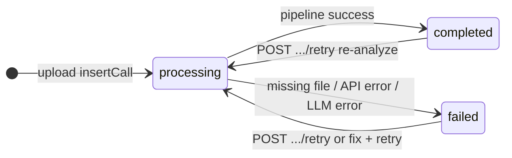

# Architecture & product guide

## 1. Introduction

**What this product does.** Sales Call Analytics is a web app where you upload sales call recordings. The system transcribes them, runs AI scoring and coaching analysis, and surfaces insights on dashboards: per-call scores, coaching tips, emotion trends, objections and competitors, and team-level comparisons. Managers can add private notes, star ratings, conversion tags, and flags for follow-up.

**Who it is for.** Sales managers, coaches, and revenue operations teams who want a single place to review calls, compare reps, and spot patterns (conversion drivers, missed questions, common objections).

**How to read this document.** Sections **1**, **8**, and **9** are written for a non-technical audience. Sections **3–7** and **10** are for engineers and operators. **Section 11** is a short glossary for terms like *transcript*, *API*, *SQLite*, and product-specific phrases used in the UI.

---

## 2. High-level architecture

Data stays on your machine (or server): a **single SQLite file** and uploaded audio files—typical **self-hosted / single-tenant** deployment. By default the database is `data/app.db`; set **`DATABASE_PATH`** to use another path.

---

## 3. Technology stack

| Layer | Technology | Purpose |
|-------|------------|---------|
| Framework | Next.js 14 (App Router) | Pages, API routes, server-side rendering |
| UI | React 18, Tailwind CSS | Components and styling |
| Components | shadcn/ui + Base UI | Accessible primitives (buttons, tables, cards, etc.) |
| Charts | Recharts | Dashboard, agent, and leaderboard charts |
| Database | better-sqlite3 | Embedded SQLite; synchronous access from the Node server |
| Speech | AssemblyAI | Transcription and speaker diarization |
| LLM | `@google/generative-ai` and/or `@anthropic-ai/sdk` | Structured JSON analysis and coaching (see `lib/gemini-analysis.ts`, `lib/claude.ts`; orchestration in `lib/analyze-transcript.ts`) |
| Audio UI | wavesurfer.js | Waveform on the call detail page |
| Toasts | sonner | User notifications |

Also: **TypeScript** across the app, **ESLint** via `next lint`, and configuration through **`.env.local`** (never commit secrets).

---

## 4. Repository / folder structure

Not every file is listed—this is the mental map of the repo.

| Path | Purpose |
|------|---------|
| `app/(dashboard)/` | Authenticated-style shell: **dashboard** home, **upload**, **calls** list and **call detail**, **agents** (`agents/[slug]`), **leaderboard**. |
| `app/api/` | REST-style handlers: upload, process-call, call CRUD, audio streaming, manager review `PATCH`, etc. |
| `components/` | Feature UI: charts, tables, coaching cards, sidebar, shared layout pieces. |
| `lib/` | Core logic: **`db.ts`** (schema, queries), **`process-call.ts`** (pipeline), **`analyze-transcript.ts`** (LLM routing), **`team-analytics.ts`** / **`dashboard-stats.ts`**, **`types.ts`**, uploads helpers, prompts. |
| `data/` | Default location for **`app.db`** (and typically uploads under `data/uploads/` unless overridden). |
| `scripts/dev.cjs` | Dev server entry (port handling, etc.). |

---

## 5. Database structure

Defined in `lib/db.ts` (`SCHEMA`) with additive **migrations** for newer `calls` columns.

### Table `calls`

- **Identity & files:** `id` (TEXT PK), `file_name`, `file_url` (path used for disk lookup), `duration_seconds`.
- **Pipeline:** `status` — `processing` | `completed` | `failed`.
- **Transcript:** `transcript` (full text), `transcript_segments` (JSON array of timed segments with speaker labels).
- **Participants:** `agent_name`, `agent_talk_percent`, `customer_talk_percent`.
- **Scores & narrative:** `overall_score`, `sentiment` (`positive` / `neutral` / `negative`), `call_summary`, JSON text columns for `positive_observations`, `negative_observations`, `action_items`, `keywords`.
- **Rich analysis:** `extended_insights` — JSON text; see **`ExtendedCoachInsights`** in `lib/types.ts` (objections, competitors, emotion timeline, filler counts, coaching tips, best moments, missed opportunities, conversion probability, question quality, next best action, etc.).
- **Manager review:** `manager_notes`, `manager_rating`, `conversion_tag`, `flagged_for_review`, `reviewed_at`, `reviewed_by`.
- **Audit:** `created_at`.

### Table `performance_scores`

One row per call (FK `call_id` → `calls.id`, `ON DELETE CASCADE`). Five dimensions, each **1–10**: `communication_clarity`, `politeness`, `business_knowledge`, `problem_handling`, `listening_ability`.

### Table `questionnaire_coverage`

Per-call, per-topic rows: `question_topic`, `was_asked` (0/1), FK to `calls`.

### Indexes and pragmas

- **Indexes:** `idx_calls_created_at` (DESC), `idx_calls_status`.
- **WAL mode:** `journal_mode = WAL` for safer concurrent reads/writes.
- **Path:** `getDbPath()` — `process.env.DATABASE_PATH` or `data/app.db` under `process.cwd()`.

---

## 6. Technical / data flow

### Upload

`POST` to `app/api/calls/upload/route.ts` saves the file to disk and inserts a `calls` row with **`processing`** status.

### Processing pipeline

`lib/process-call.ts` (`processCallById`):

1. Load audio from disk (`file_url` → absolute path).
2. **AssemblyAI:** transcribe with `speaker_labels: true`; optional **`ASSEMBLYAI_SPEECH_MODELS`** (comma-separated, default includes `universal-2`).
3. Derive **segments** and **agent/customer talk percentages** (`lib/talk-time.ts`).
4. **LLM:** `analyzeTranscript` in `lib/analyze-transcript.ts` — Gemini if `GEMINI_API_KEY` is set (unless `LLM_PROVIDER` forces otherwise), else Anthropic when `ANTHROPIC_API_KEY` is set.
5. Persist **`performance_scores`** and **`questionnaire_coverage`** (`replacePerformanceAndQuestionnaire`).
6. Merge extended fields into **`extended_insights`** (`extractExtendedInsights` from analysis) and **`updateCallCompleted`**, or set **`failed`** on errors / missing keys.

### Trigger

Clients call **`POST /api/process-call`** with `callId` (`app/api/process-call/route.ts`). The call detail UI also triggers or polls while status is `processing`.

### Read path

Server components and helpers use **`getCallBundle`** in `lib/db.ts` to load the call plus **`performance_scores`** and **`questionnaire_coverage`** in one shot. Listing and analytics use additional queries in `lib/team-analytics.ts` and related modules.

### Sequence (end-to-end)

---

## 7. End-to-end system workflow

This section ties together **routes, background behavior, and data** from first upload through team-level views. Use it as the single “how does everything connect?” map.

### 7.1 Lifecycle overview

A recording enters the system through **multipart upload**; the server writes bytes to disk and creates a **`calls`** row in **`processing`** state. The **call detail** page (or any client that POSTs the same endpoint) kicks off **`/api/process-call`**, which runs the full pipeline synchronously: **AssemblyAI** → **LLM** → SQLite. The UI **polls** while status is `processing`, then renders scores and insights. **Aggregate pages** (dashboard, leaderboard) read only from SQLite via server code—no separate analytics warehouse. **Manager review** is an optional overlay: PATCH updates the same `calls` row after analysis is done.

### 7.2 System workflow (phases)

### 7.3 Phase reference (what runs where)

| Phase | What happens | Main code / routes |
|-------|----------------|-------------------|
| **Ingest** | Validate MIME/extension, store under `calls/<id>/…`, insert DB row `processing`. | `app/api/calls/upload/route.ts`, `lib/uploads.ts`, `insertCall` |
| **Trigger** | After upload, user opens call detail; **client** POSTs `/api/process-call` once (guarded so it does not loop). Same POST is used on **retry**. | `components/call-detail-client.tsx`, `app/api/process-call/route.ts` |
| **Transcribe** | Buffer audio to AssemblyAI; write full transcript, JSON segments, duration, talk %. | `lib/process-call.ts`, `lib/talk-time.ts` |
| **Analyze** | Single structured JSON pass: scores, questionnaire topics, narrative fields, extended coach fields. | `lib/analyze-transcript.ts`, `lib/gemini-analysis.ts` / `lib/claude.ts` |
| **Persist** | Replace dimension + questionnaire rows; set `calls` to `completed` with summary, keywords, `extended_insights`. On hard failure: `status = failed`. | `lib/db.ts` |
| **Serve** | Server components / API JSON: `getCallBundle`, list endpoints, `GET /api/calls/[id]/audio` for waveform. | `lib/calls-server.ts`, `app/api/calls/*` |
| **Team analytics** | Aggregations over completed calls: radar, leaderboard, conversion comparison, team health, etc. | `lib/team-analytics.ts`, `lib/dashboard-stats.ts` |
| **Manager review** | Independent PATCH updates notes, rating, conversion tag, flag—does not re-run the LLM. | `app/api/calls/[id]/review/route.ts` |

### 7.4 Call status state machine

**Notes:**

- **`/api/calls/[id]/retry`** sets status back to `processing` (unless already `processing` → **409**), then runs `processCallById` again—full re-transcription and re-analysis.
- While **`processing`**, the call detail client **polls** `GET /api/calls/[id]` every few seconds so the UI can pick up completion without a manual refresh.

### 7.5 Failure and recovery (system behavior)

| Situation | Result |
|-----------|--------|
| Audio missing on disk | `failed`; user can re-upload or fix files and use **retry** if the row still points at a valid path. |
| Missing `ASSEMBLYAI_API_KEY` | `failed` after status update. |
| Transcription error | `failed`; message surfaced via API JSON / toast. |
| LLM error (quota, parse, etc.) | `failed`; **retry** after fixing keys or quotas. |

---

## 8. Business flow (narrative)

1. **Upload a call** — the app stores the file and queues processing.
2. **Automatic analysis** — transcription, talk-time split, AI scores, questionnaire coverage, and extended coaching JSON.
3. **Review** on the call page: summary, dimensions, transcript, waveform, emotion journey, objections, tips.
4. **Manager actions** — private notes, star rating, **conversion tag**, **flag for review** (persisted via `app/api/calls/[id]/review/route.ts`).
5. **Team views** — dashboard KPIs, **leaderboard**, **agent profile** (scores, trends, and per-call coaching on call detail).

---

## 9. Use cases (by actor)

### Sales manager / coach

- Open any completed call and read AI summary, scores, and coaching sections.
- Add **manager notes**, **rating**, **conversion tag**, and **flag** for team attention.
- Use **dashboard** and **leaderboard** to compare agents and periods; export CSV where the UI supports it.
- Review **call detail** coaching panels for objections, competitors, and missed opportunities surfaced from extended insights.

### Sales rep (indirect)

- Feedback appears as structured output: **best moments**, **coaching tips**, **missed opportunities**, and dimension scores. The app may run as a single shared workspace without per-rep login—deployment-specific.

---

## 10. Configuration & operations

### Environment variables (names only; no secrets in docs)

| Variable | Role |
|----------|------|
| `ASSEMBLYAI_API_KEY` | Transcription (required for the pipeline). |
| `ASSEMBLYAI_SPEECH_MODELS` | Optional comma-separated speech models. |
| `GEMINI_API_KEY` | Primary analysis path (typical). |
| `GEMINI_MODEL` / `GEMINI_MODELS` | Optional model override / fallback chain. |
| `ANTHROPIC_API_KEY` | Optional Claude-based analysis. |
| `ANTHROPIC_MODEL` | Optional Claude model name. |
| `LLM_PROVIDER` | Optional: `gemini` or `anthropic` when multiple keys exist. |
| `DATABASE_PATH` | Optional SQLite file path. |
| `UPLOAD_DIR` | Optional upload directory (default under `data/`). |

Secrets belong in **`.env.local`** (see `.env.example`); do not commit real keys.

### Build & run

- **Production:** `npm run build`, then `npm start`.
- **Development:** `npm run dev` (runs `scripts/dev.cjs`). You can also invoke `node scripts/dev.cjs` directly; use `-p <port>` if the default port is busy.

### Operations note

Processing calls hits external APIs and can be long-running; ensure your host allows sufficient timeouts if you deploy behind serverless limits (see project `README` for notes).

---

## 11. Glossary

| Term | Meaning |
|------|---------|
| **API** | HTTP endpoints under `/api/...` that the browser calls to upload, process, and read data. |
| **Transcript** | The text of the call, optionally split into **segments** with timestamps and speaker labels. |
| **Diarization** | Identifying *who* spoke which phrase (e.g. agent vs customer) in the transcript. |
| **Sentiment** | High-level tone label for the call: positive, neutral, or negative (from LLM analysis). |
| **Extended insights** | JSON blob on each call: objections, competitors, emotion timeline, filler words, tips, best moments, missed opportunities, conversion probability, question quality, etc. (`ExtendedCoachInsights`). |
| **Conversion tag** | Manager-set outcome bucket: e.g. converted, not converted, follow up pending (`conversion_tag` on `calls`). |
| **SQLite** | Embedded file database; no separate database server. |
| **Team health** | Dashboard metric from `teamHealthScore` in `lib/team-analytics.ts`: average **overall_score** over completed calls in the selected period, with an optional **delta** vs the prior period (for week/month filters). |

---

*This document is self-contained for export (PDF, Confluence, etc.). Diagrams use Mermaid; render with a Mermaid-capable viewer if needed.*
